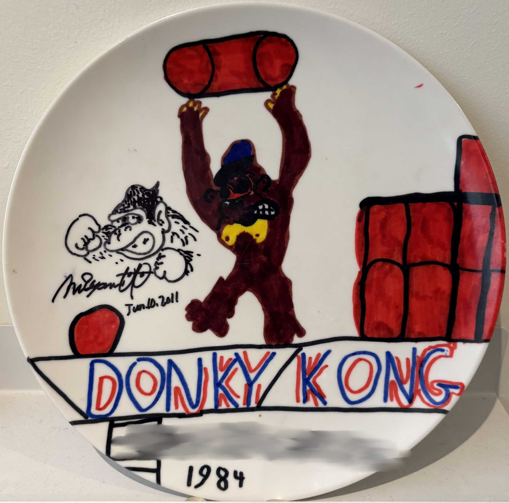

#About

<figure>
    
</figure>

I've been fascinated by coding computer games for as long as I can remember. Orson Welles once described moviemaking as "the biggest electric train set a boy ever had" - but back then they didn't have video games.

I've spent over 25 years working in the games industry, including on the Luigi's Mansion and Mario Strikers series.

This is my personal site where I share some of my hobby projects.
